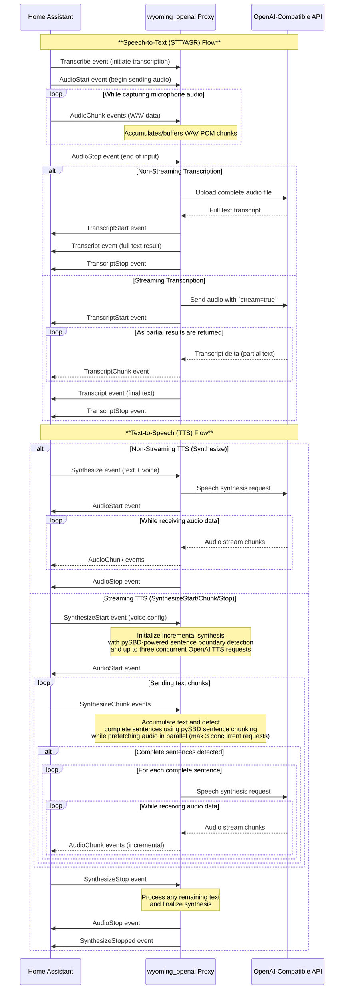
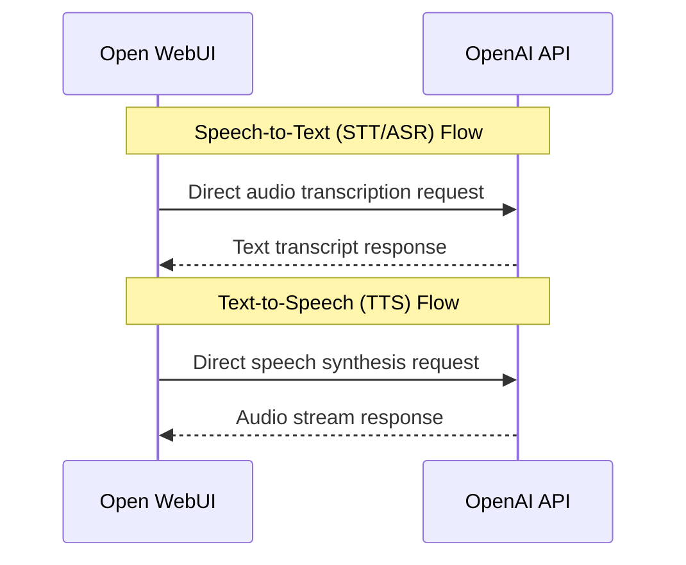

# Wyoming OpenAI

OpenAI-Compatible Proxy Middleware for the Wyoming Protocol

[](https://github.com/roryeckel/wyoming-openai/blob/main/LICENSE) [](https://pypi.org/project/wyoming-openai/) [](https://github.com/roryeckel/wyoming-openai/issues) [](https://github.com/roryeckel/wyoming-openai/pkgs/container/wyoming_openai) [](https://pypi.org/project/wyoming-openai/)

**Author:** Rory Eckel

Note: This project is not affiliated with OpenAI or the Wyoming project.

## Overview

This project introduces a [Wyoming](https://github.com/OHF-Voice/wyoming) server that connects to OpenAI-compatible endpoints of your choice. Like a proxy, it enables Wyoming clients such as the [Home Assistant Wyoming Integration](https://www.home-assistant.io/integrations/wyoming/) to use the transcription (Automatic Speech Recognition - ASR) and text-to-speech synthesis (TTS) capabilities of various OpenAI-compatible projects. By acting as a bridge between the Wyoming protocol and OpenAI, you can consolidate the resource usage on your server and extend the capabilities of Home Assistant. The proxy now provides incremental TTS streaming compatibility by intelligently chunking text at sentence boundaries with [pySBD](https://github.com/nipunsadvilkar/pySBD) for responsive audio delivery. When streaming is enabled, Wyoming OpenAI prefetches up to three OpenAI synthesis requests in parallel while playing the audio sequentially, keeping latency low without breaking event order.

## Featured Models

This project features a variety of examples for using cutting-edge models in both Speech-to-Text (STT) and Text-to-Speech (TTS) scenarios:

- **`gpt-4o-transcribe`**: OpenAI's latest and most advanced model for highly accurate speech recognition.
- **`gpt-realtime-whisper`**: OpenAI's recommended low-latency realtime transcription model for live audio and transcript deltas.
- **`gpt-4o-mini-tts`**: A compact and efficient text-to-speech model from OpenAI, perfect for responsive vocalization.
- **`voxtral-mini-latest`**: Mistral AI's multilingual Voxtral ASR, built for long-form audio (32k token context) and tested on up to ~30 minutes per file, available via [Mistral AI](#5-deploying-with-mistral-ai-voxtral) or self-hosted open weights.
- **`kokoro`**: A high-quality, open-source text-to-speech model, available for local deployment via [Speaches](#2-deploying-with-speaches-local-service) and [Kokoro-FastAPI](#4-deploying-with-kokoro-fastapi-and-speaches-local-services).
- **`piper`**: Fast, local neural text-to-speech system with multiple high-quality voices, available for local deployment via [LocalAI](#3-deploying-with-localai-local-service).
- **`whisper`**: The original renowned open-source transcription model from OpenAI, widely used for its accuracy and versatility.
- **`Microsoft Edge TTS`**: High-quality neural voices from Microsoft's free cloud TTS API, no API key required, available via [OpenAI Edge TTS](#6-deploying-with-microsoft-openai-edge-tts).
- **`Chatterbox TTS`**: Self-hosted neural speech synthesis with voice cloning, easily deployable via included Docker Compose. See [Chatterbox TTS deployment guide](#7-deploying-with-chatterbox-tts) for details.
- **`orpheus`**: Canopy Labs' open-source LLM-based TTS built on Llama 3B, trained on 100,000+ hours of English speech with human-like intonation and emotion control via tags like `[cheerful]` or `[whisper]`, available via [Groq](#8-deploying-with-groq) for ultra-fast inference.

## Objectives

1. **Wyoming Server, OpenAI-compatible Client**: Function as an intermediary between the Wyoming protocol and OpenAI's ASR and TTS services.
2. **Service Consolidation**: Allow users of various programs to run inference on a single server without needing separate instances for each service.
Example: Sharing TTS/STT services between [Open WebUI](#open-webui) and [Home Assistant](#usage-in-home-assistant).
3. **Asynchronous Processing**: Enable efficient handling of multiple requests by supporting asynchronous processing of audio streams.
4. **Streaming Compatibility**: Bridge Wyoming's streaming TTS protocol with OpenAI-compatible APIs through intelligent sentence boundary chunking powered by [pySBD](https://github.com/nipunsadvilkar/pySBD), enabling responsive incremental audio delivery even when the underlying API doesn't support streaming text input. Concurrent pipelining (default limit of three in-flight requests) keeps playback smooth while ensuring events remain ordered.
5. **Simple Setup with Docker**: Provide a straightforward deployment process using [Docker and Docker Compose](#docker-recommended) for OpenAI and various popular open source projects.

## Terminology

- **TTS (Text-to-Speech)**: The process of converting text into audible speech output.
- **ASR (Automatic Speech Recognition) / STT (Speech-to-Text)**: Technologies that convert spoken language into written text. ASR and STT are often used interchangeably to describe this function.

## Installation (Local Development)

### Prerequisites

- Tested with Python 3.12 and 3.13
- Optional: OpenAI API key(s) if using proprietary models

### Instructions

1. **Clone the Repository**

   ```bash
   git clone https://github.com/roryeckel/wyoming-openai.git
   cd wyoming-openai
   ```

2. **Create a Virtual Environment** (optional but recommended)

   ```bash
   python3 -m venv venv
   source venv/bin/activate  # On Windows use `venv\Scripts\activate`
   ```

3. **Install as a Development Package**

    ```bash
    pip install -e .
    ```
    Assuming you have activated a virtual environment, the wyoming_openai package will be installed into it. This will build and install the package in editable mode, allowing you to make changes to the code without needing to reinstall it each time.

    Or, if you prefer to install it as a regular (production) package:

    ```bash
    pip install .
    ```

    This is more suitable for a global installation.

4. **Configure Environment Variables or Command Line Arguments**

### Note on Symlinks

This repository uses symbolic links to keep AI agent configuration files tool-agnostic:

- `CLAUDE.md` → `AGENTS.md`
- `.claude/skills` → `.agents/skills`

On **Linux and macOS**, symlinks work out of the box. On **Windows**, git may check out symlinks as plain text files containing the target path instead of actual symlinks. If this happens, the AI agent configuration files will not function correctly.

To enable symlink support on Windows:

1. Enable **Developer Mode** in Windows Settings (Settings → System → For developers)
2. Either clone with symlinks enabled:
   ```bash
   git clone -c core.symlinks=true https://github.com/roryeckel/wyoming-openai.git
   ```
   Or, if you've already cloned, enable symlinks and re-checkout:
   ```bash
   git config core.symlinks true
   git checkout -- .
   ```
   > **Warning:** `git checkout -- .` will reset all working tree files — commit or stash any uncommitted changes first.

You can verify symlinks are working by checking that `CLAUDE.md` contains the full project instructions rather than just the text `AGENTS.md`.

## Installation from PyPI [](https://github.com/roryeckel/wyoming-openai/actions/workflows/publish-to-pypi.yml)

Since v0.3.2, `wyoming-openai` is now available on [PyPI](https://pypi.org/project/wyoming-openai/). To install the latest release, run:

```bash
pip install wyoming-openai
```

This is useful for local deployment when you don't want to clone the repository or if you want to use the library components in your own projects.

To upgrade to the latest version, run:

```bash
pip install --upgrade wyoming-openai
```

## Command Line Arguments

The proxy server can be configured using several command line arguments to tailor its behavior to your specific needs.

### Example Usage

Assuming you have installed the package in your current environment, you can run the server with the following command:

```bash
python -m wyoming_openai \
  --uri tcp://0.0.0.0:10300 \
  --log-level INFO \
  --languages en \
  --stt-openai-key YOUR_STT_API_KEY_HERE \
  --stt-openai-url https://api.openai.com/v1 \
  --stt-models whisper-1 \
  --stt-streaming-models gpt-4o-transcribe gpt-4o-mini-transcribe \
  --stt-realtime-models gpt-realtime-whisper \
  --stt-backend OPENAI \
  --tts-openai-key YOUR_TTS_API_KEY_HERE \
  --tts-openai-url https://api.openai.com/v1 \
  --tts-models gpt-4o-mini-tts tts-1-hd tts-1 \
  --tts-streaming-models tts-1 \
  --tts-voices alloy ash coral echo fable onyx nova sage shimmer \
  --tts-backend OPENAI \
  --tts-speed 1.0
```

## Configuration Options

In addition to using command-line arguments, you can configure the Wyoming OpenAI proxy server via environment variables. This is especially useful for containerized deployments.

### Table of Environment & Command Line Options

| **Command Line Argument**               | **Environment Variable**                   | **Default Value**                           | **Description**                                                      |
|-----------------------------------------|--------------------------------------------|-----------------------------------------------|----------------------------------------------------------------------|
| `--uri`                                 | `WYOMING_URI`                              | tcp://0.0.0.0:10300                           | The URI for the Wyoming server to bind to.                           |
| `--log-level`                           | `WYOMING_LOG_LEVEL`                        | INFO                                          | Sets the logging level (e.g., INFO, DEBUG).                          |
| `--languages`                           | `WYOMING_LANGUAGES`                        | en                                            | Space-separated list of supported languages to advertise.            |
| `--stt-openai-key`                      | `STT_OPENAI_KEY`                           | None                                          | Optional API key for OpenAI-compatible speech-to-text services.      |
| `--stt-openai-url`                      | `STT_OPENAI_URL`                           | https://api.openai.com/v1                     | The base URL for the OpenAI-compatible speech-to-text API            |
| `--stt-models`                          | `STT_MODELS`                               | None (required*)                                          | Space-separated list of models to use for the STT service. Example: `gpt-4o-transcribe gpt-4o-mini-transcribe whisper-1` |
| `--stt-streaming-models`                | `STT_STREAMING_MODELS`                     | None                                          | Space-separated list of STT models that support streaming (e.g. `gpt-4o-transcribe gpt-4o-mini-transcribe`). Only these models will use streaming mode. |
| `--stt-realtime-models`                 | `STT_REALTIME_MODELS`                      | None                                          | Space-separated list of STT models that use OpenAI Realtime transcription sessions (e.g. `gpt-realtime-whisper`). These models stream audio over `/v1/realtime` and emit Wyoming `TranscriptChunk` deltas before the final transcript. |
| `--stt-backend`                         | `STT_BACKEND`                              | None (autodetected)                           | Enable unofficial API feature sets.          |
| `--stt-temperature`                     | `STT_TEMPERATURE`                          | None (autodetected)                           | Sampling temperature for speech-to-text (ranges from 0.0 to 1.0)               |
| `--stt-prompt`                          | `STT_PROMPT`                               | None                                          | Optional prompt for STT requests (Text to guide the model's style).   |
| `--stt-extra-body`                      | `STT_EXTRA_BODY`                           | None                                          | JSON object merged into the STT request body via `extra_body` for backend-specific fields. `response_format` must remain `json`, and `stream` may override the model-derived default when set to `true` or `false`. |
| `--tts-openai-key`                      | `TTS_OPENAI_KEY`                           | None                                          | Optional API key for OpenAI-compatible text-to-speech services.      |
| `--tts-openai-url`                      | `TTS_OPENAI_URL`                           | https://api.openai.com/v1                     | The base URL for the OpenAI-compatible text-to-speech API            |
| `--tts-models`                          | `TTS_MODELS`                               | None (required*)                           | Space-separated list of models to use for the TTS service. Example: `gpt-4o-mini-tts tts-1-hd tts-1` |
| `--tts-voices`                          | `TTS_VOICES`                               | Empty (autodetected)                          | Space-separated list of voices for TTS.        |
| `--tts-backend`                         | `TTS_BACKEND`                              | None (autodetected)                           | Enable unofficial API feature sets.          |
| `--tts-speed`                           | `TTS_SPEED`                                | None (autodetected)                           | Speed of the TTS output (ranges from 0.25 to 4.0).               |
| `--tts-instructions`                    | `TTS_INSTRUCTIONS`                         | None                                          | Optional instructions for TTS requests (Control the voice).    |
| `--tts-extra-body`                      | `TTS_EXTRA_BODY`                           | None                                          | JSON object merged into the TTS request body via `extra_body` for backend-specific fields. Audio settings such as `response_format`, `speed`, and `instructions` may override top-level values, but `stream` and `stream_format` are rejected. |
| `--tts-streaming-models`                | `TTS_STREAMING_MODELS`                     | None                                          | Space-separated list of TTS models to enable incremental streaming via [pySBD](https://github.com/nipunsadvilkar/pySBD) sentence chunking that powers the TTS streaming pipeline (e.g. `tts-1`) with up to three concurrent synthesis requests. |
| `--tts-streaming-min-words`             | `TTS_STREAMING_MIN_WORDS`                  | None                                          | Minimum words per text chunk for incremental TTS streaming (optional). |
| `--tts-streaming-max-chars`             | `TTS_STREAMING_MAX_CHARS`                  | None                                          | Maximum characters per text chunk for incremental TTS streaming (optional). |

`STT_STREAMING_MODELS` and `STT_REALTIME_MODELS` select different STT transports. `STT_STREAMING_MODELS` still uses `/v1/audio/transcriptions` with response streaming after Wyoming `AudioStop`. `STT_REALTIME_MODELS` opens a `/v1/realtime` transcription session, sends 24 kHz mono PCM16 audio chunks as Wyoming audio arrives, commits on Wyoming `AudioStop`, and emits `TranscriptChunk` deltas plus a final `Transcript`.

Both `STT_EXTRA_BODY` and `TTS_EXTRA_BODY` must be valid JSON objects. The OpenAI client merges these values into the outgoing request body rather than sending a nested `extra_body` field. Supported overlaps still need to match Wyoming's transport expectations: STT continues to require `response_format="json"`, and a boolean `stream` override will update both the request body and the client's response parser for `/v1/audio/transcriptions`. TTS can override raw-audio fields such as `response_format`, `speed`, and `instructions`, but rejects `stream` and `stream_format` because the handler expects audio bytes instead of SSE-style framing.

## Docker (Recommended) [](https://github.com/roryeckel/wyoming-openai/actions/workflows/docker-image.yml)

### Prerequisites

- Ensure you have [Docker](https://www.docker.com/products/docker-desktop) and [Docker Compose](https://docs.docker.com/compose/install/) installed on your system.

### Deployment Options

You can deploy the Wyoming OpenAI proxy server in different environments depending on whether you are using official OpenAI services or a local alternative like Speaches. You can even run multiple wyoming_openai instances on different ports for different purposes. Below are example scenarios:

#### 1. Deploying with Official OpenAI Services

To set up the Wyoming OpenAI proxy to work with official OpenAI APIs, follow these steps:

- **Environment Variables**: Create a `.env` file in your project directory that includes necessary environment variables such as `STT_OPENAI_KEY`, `TTS_OPENAI_KEY`.

- **Docker Compose Configuration**: Use the provided `docker-compose.yml` template. This setup binds a Wyoming server to port 10300 and uses environment variables for OpenAI URLs, model configurations, and voices as specified in the compose file.

- **Command**:
  
  ```bash
  docker compose -f docker-compose.yml up -d
  ```

#### 2. Deploying with Speaches Local Service

If you prefer using a local service like Speaches instead of official OpenAI services, follow these instructions:

- **Docker Compose Configuration**: Use the `docker-compose.speaches.yml` template which includes configuration for both the Wyoming OpenAI proxy and the Speaches service.

- **Speaches Setup**:
  - The Speaches container is configured with specific model settings (`Systran/faster-distil-whisper-large-v3` for STT and `speaches-ai/Kokoro-82M-v1.0-ONNX` for TTS).
  - It uses a local port (8000) to expose the Speaches service.
  - NVIDIA GPU support is enabled, so ensure your system has an appropriate setup if you plan to utilize GPU resources.
  - Note: wyoming_openai disables Speaches VAD (Voice Activity Detection) by default, as it is not yet compatible with the Wyoming protocol.
  - [Learn more about Speaches](https://speaches.ai/)

- **Command**:
  
  ```bash
  docker compose -f docker-compose.speaches.yml up -d
  ```

#### 3. Deploying with LocalAI Local Service

LocalAI is a drop-in replacement for OpenAI API that runs completely locally, supporting both Whisper (STT) and Piper (TTS). This setup provides excellent privacy and performance without requiring external API keys.

- **LocalAI Setup**:
  - The provided example compose uses LocalAI's GPU-accelerated image with NVIDIA CUDA 12 support, but you can adjust things as needed.
  - Automatically downloads `whisper-base` model and multiple Piper TTS voices on first run
  - Provides OpenAI-compatible endpoints for seamless integration
  - No API keys required since everything runs locally
  - Includes automatic model initialization via dedicated init container
  - [Learn more about LocalAI](https://localai.io/)

- **Docker Compose Configuration**: Use the `docker-compose.localai.yml` template which includes configuration for both the Wyoming OpenAI proxy and LocalAI service.

- **Command**:

  ```bash
  docker compose -f docker-compose.localai.yml up -d
  ```

#### 4. Deploying with Kokoro-FastAPI and Speaches Local Services

For users preferring a setup that leverages Kokoro-FastAPI for TTS and Speaches for STT, follow these instructions:

- **Docker Compose Configuration**: Use the `docker-compose.kokoro-fastapi.yml` template which includes configuration for both the Wyoming OpenAI proxy and Kokoro-FastAPI TTS service (Kokoro).

- **Speaches Setup**:
  - Use it in combination with the Speaches container for access to STT.

- **Kokoro Setup**:
  - The Kokoro-FastAPI container provides TTS capabilities.
  - It uses a local port (8880) to expose the Kokoro service.
  - NVIDIA GPU support is enabled, so ensure your system has an appropriate setup if you plan to utilize GPU resources.
  - [Learn more about Kokoro-FastAPI](https://github.com/remsky/Kokoro-FastAPI)

- **Command**:

  ```bash
  docker compose -f docker-compose.speaches.yml -f docker-compose.kokoro-fastapi.yml up -d
  ```

#### 5. Deploying with Mistral AI Voxtral

For users who want high-quality multilingual speech transcription using Mistral AI's Voxtral model, this setup provides an excellent STT-only solution and strong multilingual accuracy with an option for self-hosting the model weights.

- **Mistral AI Voxtral Setup**:
  - Uses Mistral AI's Voxtral speech transcription API (requires Mistral API key, free tier available)
  - Supports multilingual transcription with high accuracy
  - Designed for long-form inputs (32k token context)
  - STT-only service (no TTS capabilities - combine with other services for TTS)
  - OpenAI-compatible API endpoints for seamless integration
  - [Learn more about Mistral AI](https://docs.mistral.ai/capabilities/audio_transcription)

- **Docker Compose Configuration**: Use the `docker-compose.voxtral.yml` template which includes configuration for the Wyoming OpenAI proxy with Mistral AI Voxtral backend.

- **Command**:
  
  ```bash
  docker compose -f docker-compose.voxtral.yml up -d
  ```

#### 6. Deploying with Microsoft OpenAI Edge TTS

For users who want high-quality text-to-speech without API costs, Microsoft Edge TTS provides excellent neural voices through a free cloud service. This setup requires no API keys and offers a wide variety of natural-sounding voices.

- **OpenAI Edge TTS Setup**:
  - Uses Microsoft's free cloud TTS service (no API key required)
  - Provides access to high-quality neural voices across multiple languages
  - The OpenAI Edge TTS container runs locally and proxies requests to Microsoft's service
  - Includes 17 English (US) voices by default, with support for many more languages
  - OpenAI-compatible API endpoints for seamless integration
  - [Learn more about the OpenAI-Compatible Edge-TTS API](https://github.com/travisvn/openai-edge-tts)

- **Docker Compose Configuration**: Use the `docker-compose.openai-edge-tts.yml` template which includes configuration for both the Wyoming OpenAI proxy and OpenAI Edge TTS service.

- **Command**:
  
  ```bash
  docker compose -f docker-compose.openai-edge-tts.yml up -d
  ```

#### 7. Deploying with Chatterbox TTS

For users who want high-quality local text-to-speech with voice cloning capabilities, Chatterbox TTS provides an OpenAI-compatible API with advanced voice cloning features. This setup runs completely locally and supports custom voice training.

- **Chatterbox TTS Setup**:
  - Local OpenAI-compatible text-to-speech API with voice cloning capabilities
  - Supports custom voice samples for personalized speech generation
  - Advanced voice library management with persistent storage
  - FastAPI-powered with real-time status monitoring and streaming support
  - GPU acceleration support for faster processing
  - No external API dependencies - runs completely offline
  - [Learn more about Chatterbox TTS API](https://github.com/travisvn/chatterbox-tts-api)

- **Docker Compose Configuration**: Use the `docker-compose.chatterbox.yml` template which includes configuration for both the Wyoming OpenAI proxy and Chatterbox TTS service.

- **Command**:
  
  ```bash
  docker compose -f docker-compose.chatterbox.yml up -d
  ```

#### 8. Deploying with Groq

For users who want to use Groq's fast inference cloud API, this setup provides access to high-performance Whisper models for speech recognition and Orpheus TTS for text-to-speech. Groq offers extremely fast inference speeds with their LPU (Language Processing Unit) architecture and a generous free tier that supports up to 2,000 STT requests and 100 TTS requests per day.

- **Groq Setup**:
  - Cloud-based OpenAI-compatible API with ultra-fast inference
  - Supports Whisper Large V3 for highly accurate speech recognition
  - Provides access to [Orpheus TTS](https://github.com/canopyai/Orpheus-TTS) by Canopy Labs - an open-source LLM-based TTS with human-like intonation
  - Orpheus supports emotion control via inline tags like `[cheerful]` or `[whisper]` embedded in the input text; for Home Assistant, this means prompting your LLM to include these tags in its responses
  - Generous free tier: 2,000 STT requests/day (up to 8 hours of audio) and 100 TTS requests/day
  - Requires Groq API key (sign up at [groq.com](https://groq.com))
  - No local infrastructure required
  - [Learn more about Groq](https://groq.com/)

- **Docker Compose Configuration**: Use the `docker-compose.groq.yml` template which includes configuration for the Wyoming OpenAI proxy connecting to Groq's API endpoints.

- **Environment Variables**: Create a `.env` file with your Groq API key as `STT_OPENAI_KEY` and/or `TTS_OPENAI_KEY`.

- **Command**:

  ```bash
  docker compose -f docker-compose.groq.yml up -d
  ```

#### 9. Development with Docker

If you are developing the Wyoming OpenAI proxy server and want to build it from source, use the `docker-compose.dev.yml` file along with the base configuration.

- **Command**:
  
  ```bash
  docker compose -f docker-compose.yml -f docker-compose.dev.yml up -d --build
  ```

#### 10. Example: Development with Additional Local Service

For a development setup using the Speaches local service, combine `docker-compose.speaches.yml` and `docker-compose.dev.yml`. This also works for `docker-compose.kokoro-fastapi.yml`, `docker-compose.localai.yml`, `docker-compose.voxtral.yml`, `docker-compose.openai-edge-tts.yml`, `docker-compose.groq.yml`, and `docker-compose.chatterbox.yml`.

- **Command**:
  
  ```bash
  docker compose -f docker-compose.speaches.yml -f docker-compose.dev.yml up -d --build
  ```

#### 11. Docker Tags

We follow specific tagging conventions for our Docker images. These tags help in identifying the version and branch of the code that a particular Docker image is based on.

- **`latest`**: This tag always points to the latest stable release of the Wyoming OpenAI proxy server. It is recommended for users who want to run the most recent, well-tested version without worrying about specific versions.

- **`main`**: This tag points to the latest commit on the main code branch. It is suitable for users who want to experiment with the most up-to-date features and changes, but may include unstable or experimental code.

- **`major.minor.patch version`**: Specific version tags (e.g., `0.4.4`) correspond to specific stable releases of the Wyoming OpenAI proxy server. These tags are ideal for users who need a consistent, reproducible environment and want to avoid breaking changes introduced in newer versions.

- **`major.minor version`**: Tags that follow the `major.minor` format (e.g., `0.4`) represent a range of patch-level updates within the same minor version series. These tags are useful for users who want to stay updated with bug fixes and minor improvements without upgrading to a new major or minor version.

- **`pr-{number}`**: Pull request tags (e.g., `pr-123`) are automatically created for each pull request to allow testing of proposed changes before they are merged. These tags are automatically cleaned up when the pull request is closed or merged.

#### 12. Pull Request Docker Images

For contributors and maintainers who want to test changes from pull requests before they are merged, we automatically build and push Docker images for each pull request.

**How it works:**
- When a pull request is opened or updated, a Docker image is automatically built and pushed with the tag `pr-{pr_number}`
- Only pull requests from the main repository (not forks) will trigger image builds for security reasons
- When a pull request is closed or merged, the corresponding Docker image is automatically deleted to save storage space

**Using PR images:**
```bash
# Example: Test PR #123
docker run --rm -p 10300:10300 ghcr.io/roryeckel/wyoming_openai:pr-123

# Or with docker-compose, update your docker-compose.yml:
# image: ghcr.io/roryeckel/wyoming_openai:pr-123
```

**For contributors:**
- PR images are built automatically - no action needed
- Images are available within minutes of opening/updating a PR
- Check the Actions tab to see build status
- Images are automatically cleaned up when the PR is closed

### General Deployment Steps

1. **Start Services**: Run the appropriate Docker Compose command based on your deployment option.
2. **Verify Deployment**: Ensure that all services are running by checking the logs with `docker compose logs -f` or accessing the Wyoming OpenAI proxy through its exposed port (e.g., 10300) to ensure it responds as expected.
3. **Configuration Changes**: You can modify environment variables in the `.env` file or directly within your Docker Compose configuration files to adjust settings such as languages, models, and voices without rebuilding containers.

## Usage in Home Assistant

1. Install & set up your Wyoming OpenAI instance using one of the [deployment options](#deployment-options) above.
2. In HA, Go to Settings, Devices & Services, Add Integration, and search for Wyoming Protocol. Add the Wyoming Protocol integration with the URI of your Wyoming OpenAI instance.
3. The hard part is over! Configure your Voice Assistant pipeline to use the STT/TTS services provided by your new Wyoming OpenAI instance.

#### Reloading Configuration Changes in Home Assistant

When you make changes to your configuration such as updating models, voices, or URLs, it's important to reload the Wyoming OpenAI integration in Home Assistant to apply these changes. Here's how to do it:

1. Go to **Settings** > **Devices & Services**
2. Find and select your **Wyoming OpenAI** integration
3. Click on **Reload**

### Sequence Diagrams

#### Home Assistant

Home Assistant uses the Wyoming Protocol integration to communicate with the Wyoming OpenAI proxy server. The proxy server then communicates with the OpenAI API to perform the requested ASR or TTS tasks. The results are then sent back to Home Assistant.



#### Open WebUI

No proxy is needed for Open WebUI, because it has native support for OpenAI-compatible endpoints.



## Future Plans (Descending Priority)

- Improved streaming support directly to OpenAI APIs
- Reverse direction support (Server for OpenAI compatible endpoints - possibly FastAPI)
- OpenAI Realtime API

## Contributing

Contributions are welcome! Please feel free to open issues or submit pull requests. For major changes, please first discuss the proposed changes in an issue.

## Quality Assurance

### Linting (Ruff) [](https://github.com/roryeckel/wyoming-openai/actions/workflows/lint.yml)

This project uses [Ruff](https://github.com/astral-sh/ruff) for linting and code quality checks. Ruff is a fast Python linter written in Rust that can replace multiple tools like flake8, isort, and more.

To use Ruff during development:

1. Install development dependencies:
   ```bash
   pip install -e ".[dev]"
   ```

2. Run Ruff to check your code:
   ```bash
   ruff check .
   ```

A GitHub Action automatically runs Ruff on all pull requests and branch pushes to ensure code quality.

### Type Checking (Pyright)

This project uses [Pyright](https://github.com/microsoft/pyright) for static type checking. Pyright is a fast, full-featured Python type checker from Microsoft that helps catch type errors before runtime.

To use Pyright during development:

1. Install development dependencies:
   ```bash
   pip install -e ".[dev]"
   ```

2. Run Pyright to type-check your code:
   ```bash
   pyright
   ```

Pyright configuration is defined in `pyproject.toml` under `[tool.pyright]`.

### Testing (Pytest) [](https://github.com/roryeckel/wyoming-openai/actions/workflows/test.yml)

This project uses [pytest](https://pytest.org/) for unit testing. Tests are located in the [`tests/`](tests/) directory and cover core modules such as compatibility, constants, handlers, initialization, and utilities.

#### Running Tests

1. Install development dependencies:
   ```bash
   pip install -e ".[dev]"
   ```

2. In the [`tests/`](tests/) folder, run all tests with:
   ```bash
   pytest
   ```

3. Check the test coverage with:
   ```bash
   pytest --cov=wyoming_openai
   ```

All new code should include appropriate tests.
A GitHub Action automatically runs pytest on all pull requests and branch pushes to ensure tests pass.
